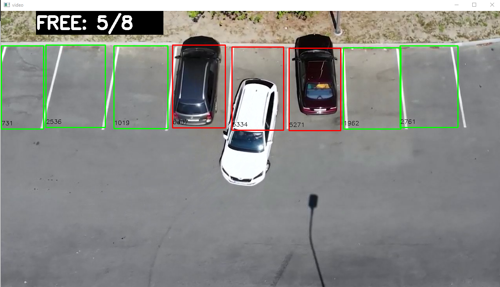

# Vacancy Counter

This is my first project in Python using opencv to count available vacancies.
## Running locally

Clone the project

```bash
  git clone https://github.com/pabloguedesc/vacancy_counter.git
```

Enter the project directory

```bash
  cd 'The folder name where the project was cloned'
```

Install the depedencies

```bash
  pip install opencv-python
```

```bash
  pip install numpy
```

Run 

```bash
    python main.py
```
## Screenshots


